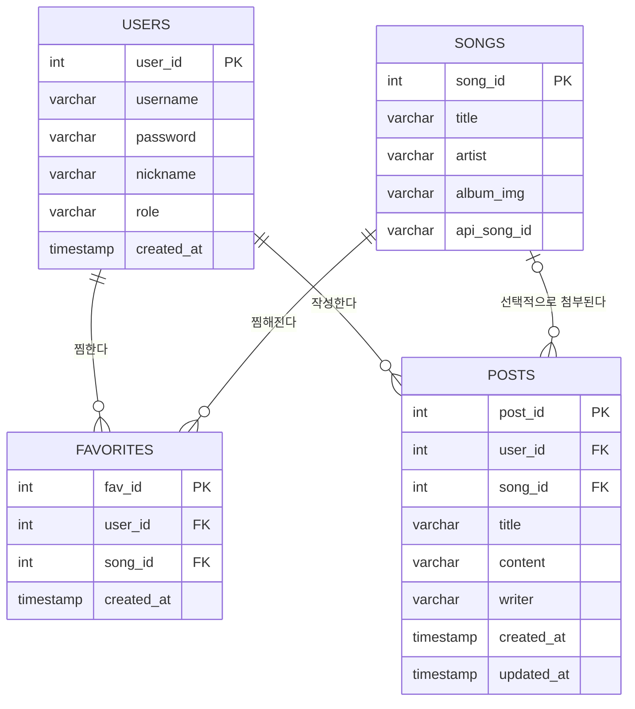

# Muzip ERD

기준 파일: [`src/main/resources/schema.sql`](../src/main/resources/schema.sql)

- `favorites`, `posts`의 `user_id` → `users.user_id`, `song_id` → `songs.song_id` 외래 키
- `posts.song_id`는 글쓰기 시 곡 선택이 필수가 아니라 NULL 허용
- title/content 길이(140자)는 `PostCreateRequest`의 `@Size(max = 140)` 검증과 일치
