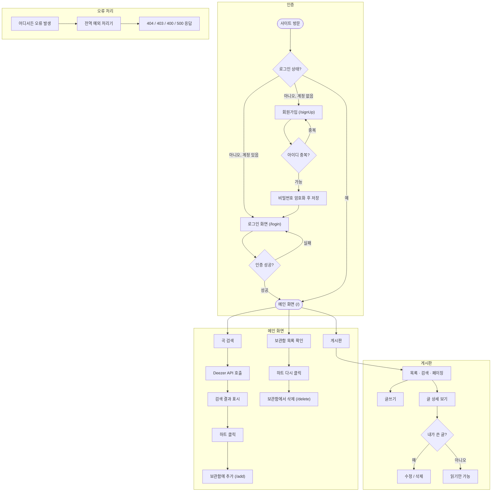

# Muzip 기능 플로우

- **인증**: 회원가입은 아이디 중복 체크 후 비밀번호를 BCrypt로 암호화해 저장. 로그인은 Spring Security가 처리.
- **메인 화면**: 곡 검색은 외부 Deezer API 호출 결과이고, 보관함(하트)은 DB에 저장/삭제됨.
- **게시판**: 목록/검색/페이징은 서버 API(`/api/post`)로 처리되고, 수정·삭제는 작성자 본인만 가능.
- **오류 처리**: 어느 기능에서 예외가 나든 `GlobalExceptionHandler`가 한곳에서 응답 형식을 통일함.
